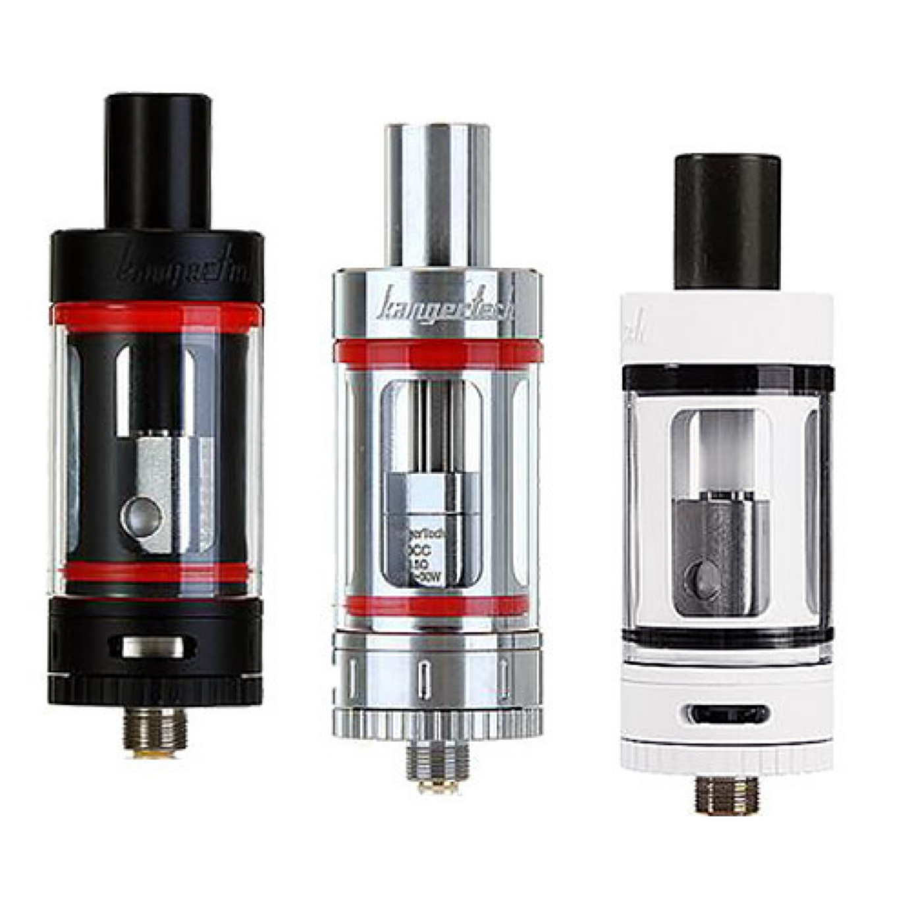

# Welcome to SIR project

This is an example of computational experiment of  **Electronic Drug Delivery System (EDDS) Kangertech 4th**

The goal of the research was simulation of how flow from the device moving to a mouth.